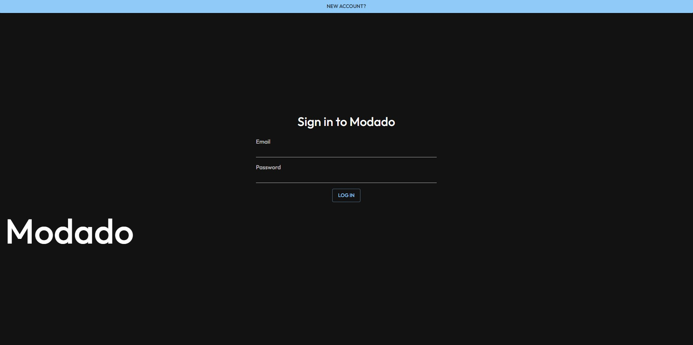
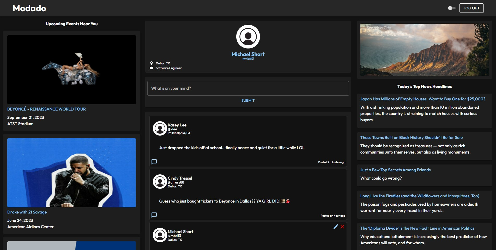
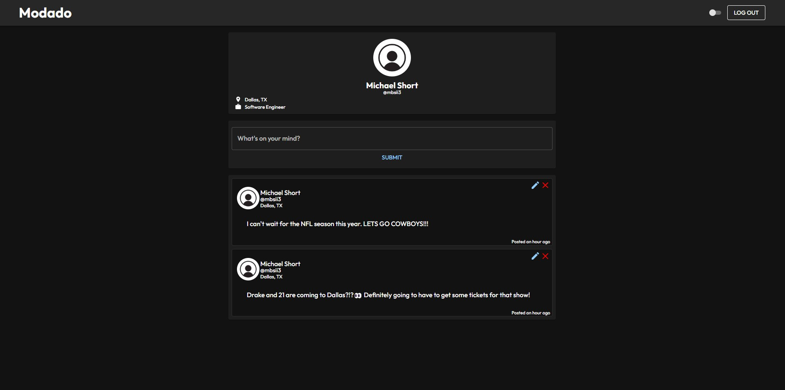
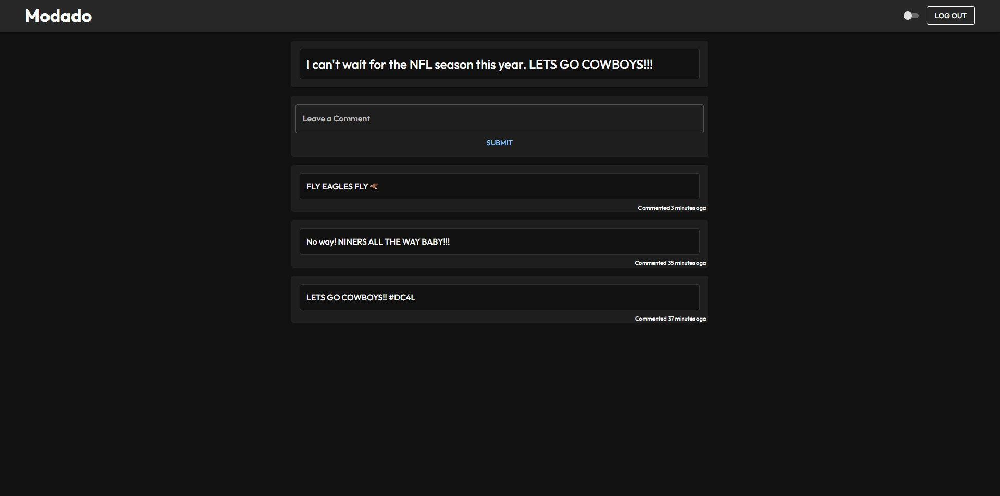
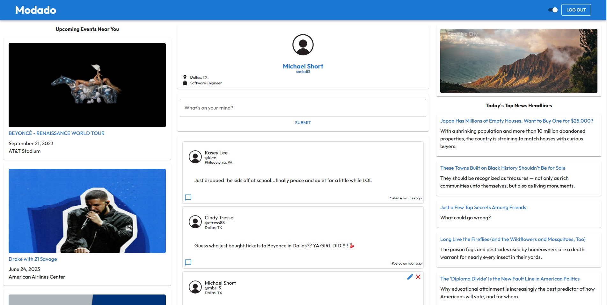

# Modado

Modado is a social media dashboard that allows users to create, edit and delete their own posts and leave comments on other users posts.  The dashboard dynamically renders popular upcoming events near them based on their geo IP location and the top news articles trending.  The dash also includes a quick and easy weather data fetching widget thats allows users to get prepared for their day while getting caught up on the current events going on in the world.

## About The Project

I was inspired to develop Modado because social media is a great way for individuals to connect with others who have similar interests. There are many different types of social media platforms, but I wanted to create one that is in a dashboard layout that allows users easy access to information that they are interested in, kind of like a daily news and social media dashboard.  Due to React's powerful utilization of components and state, I wanted to create a UI where many components can render different information depending on user input and it not affect other components due to re-rendering. Several third party APIs are being utilized to to pull information from other sources and it was great to test the capabilities of React's state and component features.

* The application is user-centric, so all users are able to create and see their posts on the public feed, however on their profile feed they will only see their own posts that they have created.
* The application provides full CRUD functionality, allowing users to create, edit, and delete new posts and are able to create comments on posts as well.
* The UI was developed with simplicity and a user-first mindset with a heavy focus on a social media dashboard feel.
* JWT was utilized to create an authorized user and securely salt the users password in the database. 
* EnsureLoggedIn middleware was utilized to ensure no rogue users are able to access user information if the server timesout.
* Data was sourced from OpenWeather API, NewsData.io, and SeatGeek API for the weather widget, top news headlines, and upcoming events.
* Application utilizes Heroku for easy access and deployment.

## Built With:

* 
* 
* 
* 
* 
* 
* 
* 
* 
* 
* 
* 
* 

## Getting Started

The web application is currently deployed on Heroku and can be accessed here: https://modado.herokuapp.com/

Link to Trello board for project organization and task management: https://trello.com/b/Omz0kvAe/project-4

## Future Features

* Optimize the application with a responsive design for mobile, tablet, and smaller screen devices.
* Allow users to upload photos to their posts.
* Allow users to like other users posts.
* Allow users to follow other users.